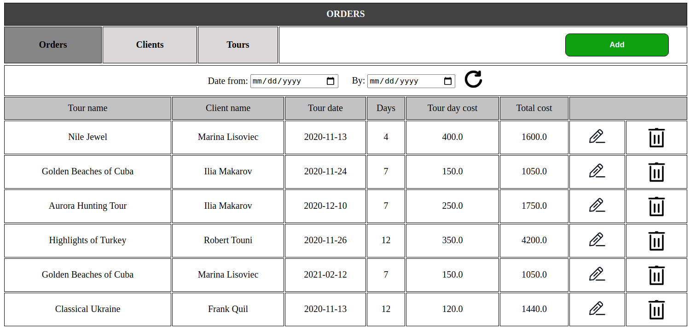
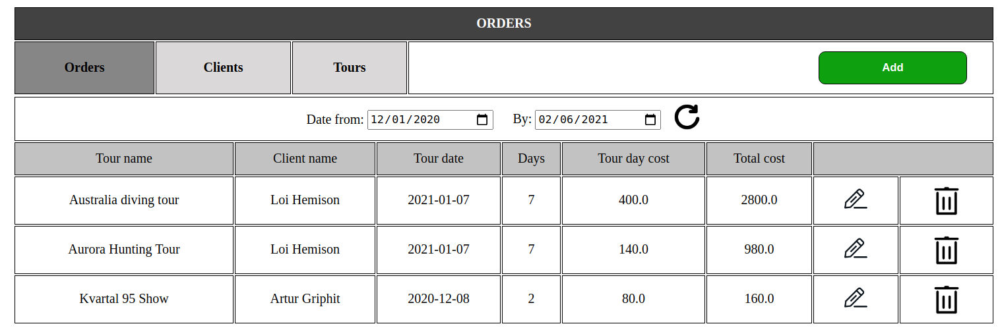
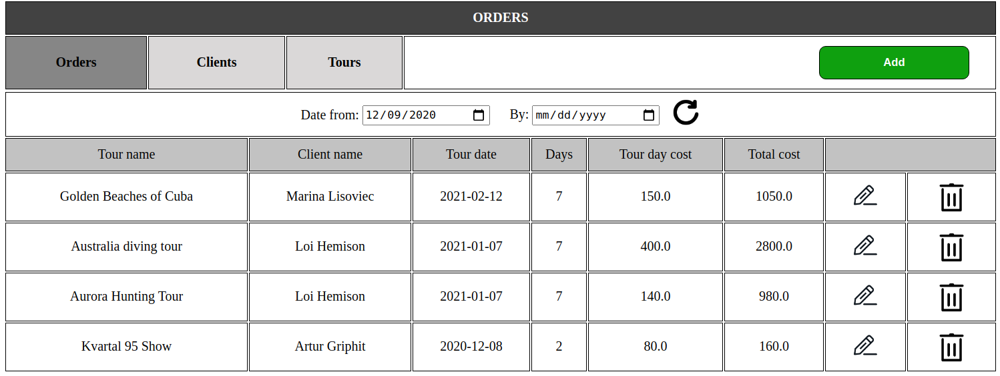
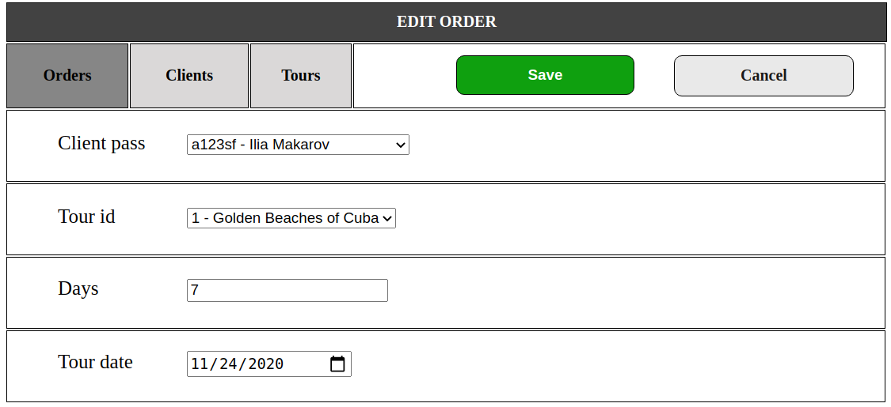
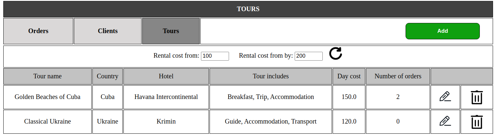
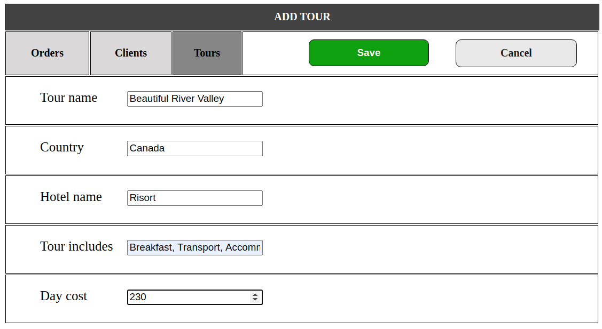

# Travel agancy admin panel using Flask
## 1. Introduction
Today, the travel business is a huge industry. More than 150 million people buy at least one tour a year.
My project is a very convenient travel agancy management system. Which will be used by the administration of the service to easily manage the database of their company.

### 1.1 Purpose
The system provides an interface for managing orders, tours and clients. Makes it easy to add delete or edit existing instances.

### 1.2 Application provides:
    - Orders managing
        - Add new order
        - Delete order
        - Edit existing order
        - Filter orders by tour start date
    - Clients managing
        - Add new client
        - Delete client
        - Edit exsting client
        - Sort clients by: 
            - First name
            - Last name
            - Number of orders
    - Tours managing
        - Add new tour
        - Delete tour
        - Edit existing tour
        - Sort tours by price
        
## 2 Instances of application

### 2.1 Orders
  The model which is used to control client`s orders, consists of:
#####
        - Tour name
        - Client name
        - Tour date: the date when tour starts
        - Days: duration of the tour
        - Tour day cost
        - Tour total cost: full price that is equal day_cost * days
  

#### 2.1.1 Display all orders

Admin is able to filter the orders by selecting dates of tour, using a panel at the top of table.

Here we can see filtered orders:

(All the orders will execute between 12/01/20 and 02/06/21)  
System allows user to filter all the orders that will be done after certain date, but without constraints 
on by date, by selecting 'From date:' and leaving the 'By date' blank. And vice verca.  
Here an example:

(All the orders will execute after 12/09/20)
  
#### 2.1.2 Adding new order
To add a new order admin have to select the client which will be the owner, the tour
which will be the destination, number of days(the duration of tour), and the date, when does the client
wants to set off.

After pressing the "Save" button the order will be saved into a database and admin will be redirected
onto main orders page, where would be able to see the all the orders, including the one 
he has just added.
 
In order to cancel adding, admin can push "Cancel" button, and will be directly redirected
onto main orders page.
#### 2.1.3 Editing order
To edit existing order, user can push the "Edit" button, which is placed in the right side of 
each row of the table, and looks like a pen.
 
After that will be opened the special window of editing form, where we can change any 
stat we want to be changed, and press button "Save" to commit the changed into a database, or 
push a button "Cancel" to cancel the editing and return to the main table.
 
Here an example:

#### 2.1.4 Deleting order
The admin can delete order if it is needed by pressing the "Delete" button, which is placed in the right
side of the each row, and looks like a trash bin

### 2.1 Tours
  The model which is used to control tours, consists of:
#####
        - Tour name
        - Country
        - Hotel
        - Tour includes
        - Day cost
        - Number of orders

#### 2.1.1 Display all tours

Admin is able to filter the tours by selecting cost of the one tour`s day
, using a panel at the top of table and press "Refresh" button to filter.

Here we can see filtered tours:

(All the orders will execute between 12/01/20 and 02/06/21)  
System allows user to filter all the tours depending on thier cost, we can also
leave from cost or by cost blank.  
 
#### 2.1.2 Adding new tour
To add a new tour admin have to select the tour name, the country and hotel name, also the 
tour includes have to be selected and day cost set.

After pressing the "Save" button the tour will be saved into a database and admin will be redirected
onto main tours page, where would be able to see the all the tours, including the one 
he has just added.
 
In order to cancel adding, admin can push "Cancel" button, and will be directly redirected
onto main tours page.
#### 2.1.3 Editing tours
To edit existing order, user can push the "Edit" button, which is placed in the right side of 
each row of the table, and looks like a pen.
 
After that will be opened the special window of editing form, where we can change any 
stat we want to be changed, and press button "Save" to commit the changed into a database, or 
push a button "Cancel" to cancel the editing and return to the main table.
 
Here an example:

#### 2.1.4 Deleting order
The admin can delete order if it is needed by pressing the "Delete" button, which is placed in the right
side of the each row, and looks like a trash bin

