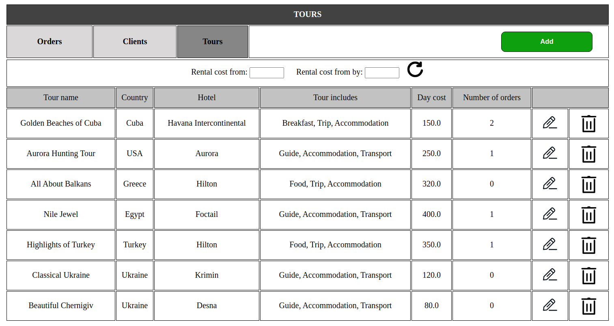

#Travel agancy admin panel using Flask
##1. Introduction
Today, the travel business is a huge industry. More than 150 million people buy at least one tour a year.
My project is a very convenient travel agancy management system. Which will be used by the administration of the service to easily manage the database of their company.

###1.1 Purpose
The system provides an interface for managing orders, tours and clients. Makes it easy to add delete or edit existing instances.

###1.2 Application provides:
    - Orders managing
        - Add new order
        - Delete order
        - Edit existing order
        - Filter orders by tour start date
    - Clients managing
        - Add new client
        - Delete client
        - Edit exsting client
        - Sort clients by: 
            - First name
            - Last name
            - Number of orders
    - Tours managing
        - Add new tour
        - Delete tour
        - Edit existing tour
        - Sort tours by price

o add a new client or new tour, check how many people chose each tour or how many tours each client ordered.